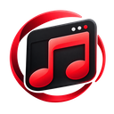

<p align="center"></p>

# MusicDesktop for Deckboard

Control MusicDesktop from your Deckboard buttons, with live playback states
and the current track title.

## Requirements

- Windows 10 or 11.
- Deckboard 3.2.0 (the version used for compatibility checks).
- MusicDesktop 2.0.3 or later, installed on the same PC.
- Streamer Mode enabled in MusicDesktop for playback commands.

## Installation

1. Download `musicdesktop-deckboard.asar` from this repository's release.
2. Copy it into `%USERPROFILE%\deckboard\extensions`. Create the folder if needed.
3. Quit Deckboard completely and restart it.
4. In MusicDesktop, open **Settings → Streamer**, enable Streamer Mode and open
   the dashboard. In **Controls**, select **Copy connection**.
5. In Deckboard **Settings → Extensions → Configuration**, find MusicDesktop,
   paste the copied text into **MusicDesktop Connection**, set **Extension
   ON / OFF** to **ON**, then save. Restart Deckboard if requested.
6. Add MusicDesktop actions to your buttons and choose their commands.

Do not open the `.asar` as a Windows application. It is an extension package.

## Features

- Play, pause, previous/next track and volume commands.
- Mute, shuffle, repeat and seek controls.
- Show, hide or toggle the Mini Player.
- Toggle Streamer Mode through the installed MusicDesktop application link.
- Current track and connection status text.
- Live text states for playback and toggle buttons.
- One shared connection, with automatic reconnect and no HTTP state polling.
- French and English labels, chosen through the copied connection.

Volume values use 0–100%; seek values use seconds. The Streamer toggle requires
the installed MusicDesktop 2.0.3 Windows URI association. Turning this extension
OFF releases its connection and reconnect timers. Deckboard does not expose
per-button visibility hooks, so switching boards alone does not stop it.

## Connection and privacy

The extension calls MusicDesktop's authenticated local API. The phone sends
button presses through Deckboard's normal connection to the desktop application.
MusicDesktop's service listens on this PC only.

The copied connection contains a control secret. Keep it private, including
configuration backups that contain it. If you change MusicDesktop's Streamer
port, copy the connection into Deckboard again.

## Français

Téléchargez le `.asar`, copiez-le dans `%USERPROFILE%\deckboard\extensions`, puis
redémarrez Deckboard. Dans MusicDesktop, activez **Paramètres → Streamer**, ouvrez
le panneau puis **Commandes → Copier la connexion**. Dans les paramètres de
l'extension Deckboard, collez cette connexion, mettez **Extension ON / OFF** sur
**ON**, puis enregistrez. Ajoutez vos boutons MusicDesktop. Gardez la connexion
et les sauvegardes qui la contiennent privées.

## License

MIT — Akyrais. Third-party notices are included in the extension package.

MusicDesktop downloads: https://github.com/Azashiin/Music-Desktop-Releases/releases

## Development and verification

Only the Deckboard client and its shared local API helpers are published here. The MusicDesktop application source is not included.
Building requires Node.js 22.12 or later. The packaged extension targets the
Node 16+ runtime provided by its Deckboard host.

```powershell
npm ci --prefix integrations/deckboard
npm run build
npm test
```

The build outputs `frontend/public/integrations/musicdesktop-deckboard.asar`.
Tests use the bundled Deckboard SDK with a simulated host and a local HTTP/WebSocket fixture. They cover packaging, actions, live values, reconnect, redirects and cleanup. They do not operate a real Deckboard application or phone.

[Download extension 2.0.3](https://github.com/Azashiin/MusicDesktop-Deckboard/releases/tag/v2.0.3) · [MusicDesktop 2.0.3](https://github.com/Azashiin/Music-Desktop-Releases/releases/tag/v2.0.3)
